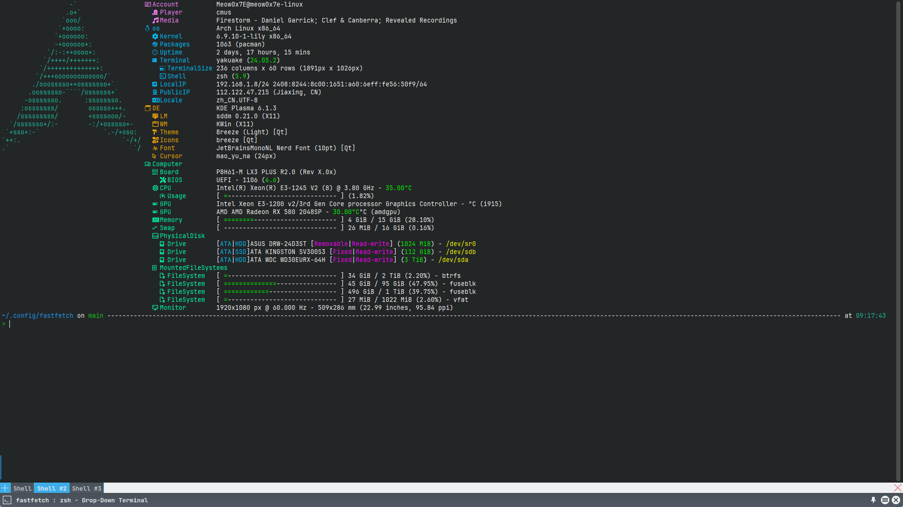

# config-fastfetch

[zh_CN](README-zh_CN.md)|[en_US](README.md)

一个简单的 [fastfetch][1] 配置文件，可以让你的 [fastfetch][1] 更加花哨。

## 预览



## 使用方式

选择以下任一方式即可完成配置

### 手动下载

1. 下载 [config.jsonc](config.jsonc)
2. 将其放到 `$HOME/.config/fastfetch` 目录下。

### 运行命令

运行以下命令即可应用配置

```bash
[[ -d "$HOME/.config/fastfetch" ]] || mkdir "$HOME/.config/fastfetch"
curl -L -S -s -O --output-dir "$HOME/.config/fastfetch" https://raw.githubusercontent.com/Meow0x7E/config-fastfetch/main/config.jsonc
```

[1]: https://github.com/fastfetch-cli/fastfetch
