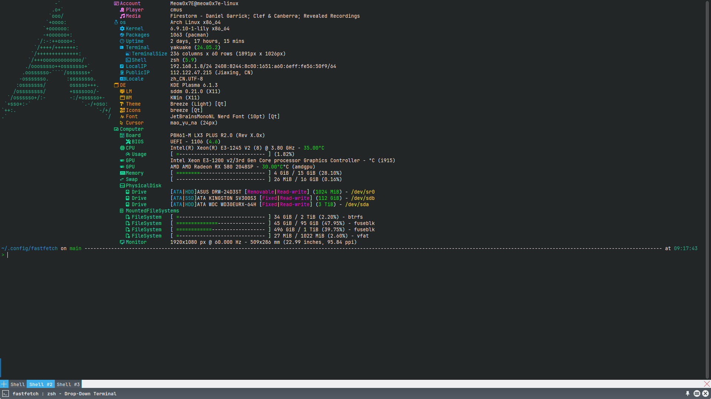

# config-nvim

一个简单的 [fastfetch][1] 配置文件，可以让你的 [fastfetch][1] 更加花哨。

预览:


# 使用方式

- 手动下载 [config.jsonc](blob/main/config.jsonc)，并将其放到 `~/.config/fastfetch` 目录下。
- 直接 clone 这个仓库
```bash
git clone https://github.com/Meow0x7E/config-fastfetch ~/.config/fastfetch
```
[1]: https://github.com/fastfetch-cli/fastfetch
